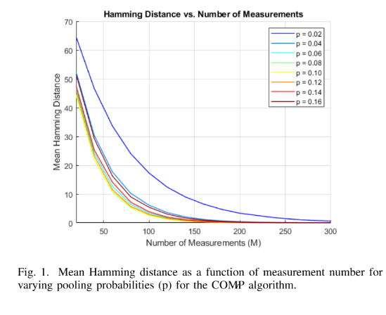
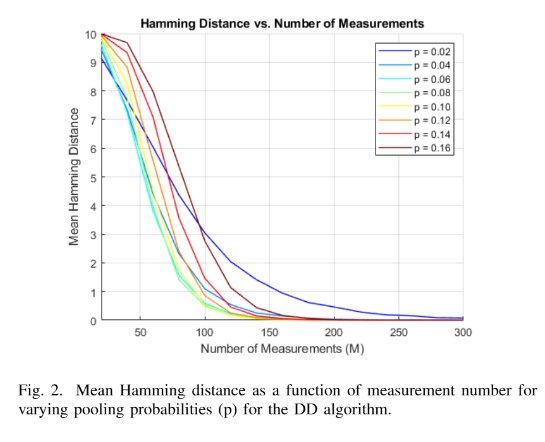
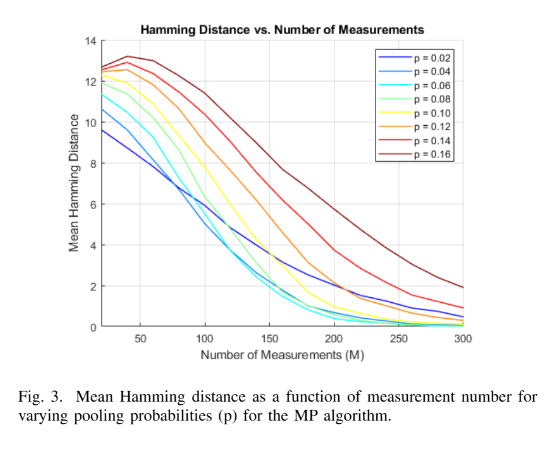
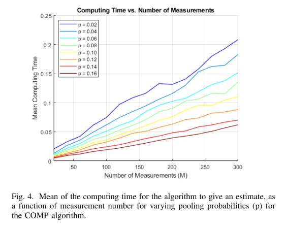
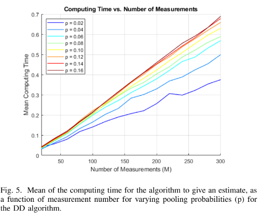
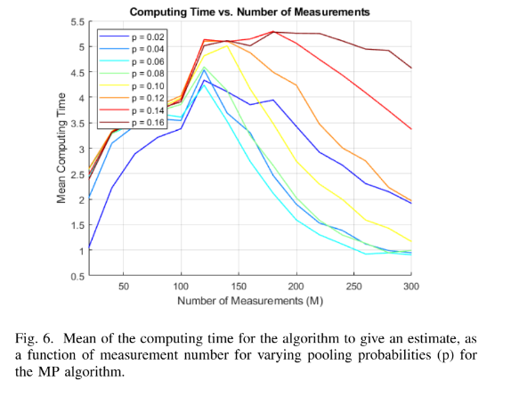

# Boolean Compressed Sensing in MATLAB

This repository contains MATLAB implementations of Boolean compressed sensing algorithms for non-adaptive group testing.

The project studies how to recover a sparse binary vector from pooled Boolean measurements. This setting appears in applications such as medical pooled testing, rare-event detection, defective item identification, and sparse binary signal recovery.

## Overview

In classical compressed sensing, the goal is to recover a sparse vector from linear measurements. In Boolean compressed sensing and group testing, the unknown signal is binary:

$$
x \in \{0,1\}^{N},
$$

where $x_i = 1$ means that item $i$ is defective or positive, and $x_i = 0$ means that it is non-defective.

The measurement matrix is also binary:

$$
A \in \{0,1\}^{M \times N}.
$$

Each row of $A$ represents one pooled test. If $A_{m,i} = 1$, then item $i$ is included in test $m$.

The test outcome is generated using a Boolean OR operation:

$$
y_m = \bigvee_{i=1}^{N} A_{m,i} x_i,
$$

where $y_m = 1$ if at least one defective item is present in pool $m$, and $y_m = 0$ otherwise.

The goal is to estimate the unknown sparse binary vector $x$ from the test matrix $A$ and the Boolean measurements $y$.

## Repository Structure

```text
boolean-compressed-sensing-matlab/
│
├── README.md
├── LICENSE
│
├── data/
│   └── group_testing_samples.mat
│
├── src/
│   ├── run_group_testing_experiments.m
│   │
│   └── algorithms/
│       ├── comp_decoder.m
│       ├── dd_decoder.m
│       ├── boolean_matching_pursuit.m
│       └── nonnegative_lasso_decoder.m
│
└── figures/
    ├── comp_hamming_distance.png
    ├── dd_hamming_distance.png
    ├── mp_hamming_distance.png
    ├── comp_runtime.png
    ├── dd_runtime.png
    └── mp_runtime.png
```

## Implemented Files

| File | Description |
|---|---|
| `src/run_group_testing_experiments.m` | Main simulation script. Loads the dataset, generates Bernoulli pooling matrices, runs the selected decoder, and evaluates Hamming distance, runtime, false positives, and false negatives. |
| `src/algorithms/comp_decoder.m` | Combinatorial Orthogonal Matching Pursuit decoder for group testing. |
| `src/algorithms/dd_decoder.m` | Definite Defectives decoder. |
| `src/algorithms/boolean_matching_pursuit.m` | Matching Pursuit-style greedy sparse recovery adapted to the Boolean measurement setting. |
| `src/algorithms/nonnegative_lasso_decoder.m` | Experimental non-negative LASSO baseline using MATLAB's `lasso` function. |
| `data/group_testing_samples.mat` | Dataset containing sparse binary test vectors. |

## Dataset

The dataset contains sparse binary vectors of length

$$
N = 100.
$$

Each vector represents a group of 100 items. A value of 1 means the item is defective or positive, while a value of 0 means the item is non-defective.

The simulations evaluate recovery performance over multiple sparse binary samples.

## Measurement Design

The measurement matrix $A$ is generated randomly using a Bernoulli pooling model:

$$
A_{m,i} \sim \mathrm{Bernoulli}(p),
$$

where $p$ is the pooling probability.

The pooling probability controls how many items are included in each test. In the experiments, the pooling probability is varied as

$$
p \in \{0.02, 0.04, 0.06, 0.08, 0.10, 0.12, 0.14, 0.16\}.
$$

The number of measurements is varied as

$$
M \in \{20, 40, 60, \ldots, 300\}.
$$

For each pair $(p,M)$, a new random pooling matrix is generated and the decoder estimates the sparse binary vector.

## Algorithms

### COMP Decoder

The COMP algorithm starts by assuming that every item could be defective.

Then it looks at all negative tests. If a test result is negative, then every item included in that test must be non-defective. These items are removed from the possible defective set.

The remaining items are returned as defective.

This rule is simple and computationally efficient. A key property is that COMP does not produce false negatives in the noiseless setting, because it only marks an item as non-defective when it appears in a negative test.

### Definite Defectives Decoder

The DD algorithm first removes all items that appear in negative tests. The remaining items are possible defectives.

Then it checks positive tests. If a positive test contains exactly one possible defective item, that item is marked as definitely defective.

The DD algorithm is more conservative than COMP. It usually needs fewer measurements to reach low Hamming distance in this experiment, and it avoids false positives in the noiseless setting.

### Boolean Matching Pursuit

The Matching Pursuit implementation is a greedy sparse recovery method adapted to Boolean measurements.

It initializes the estimate as zero and repeatedly selects the column of $A$ that is most correlated with the current residual. The estimate is updated, and the residual is recomputed using a Boolean thresholding step:

$$
r = y - \mathbf{1}\{Az \geq 1\}.
$$

This method is closer to standard sparse recovery, but it is not specifically designed for group testing. In the experiments, it requires more measurements and more computation time than COMP and DD.

### Non-negative LASSO

The non-negative LASSO implementation is included as an experimental baseline. It uses MATLAB's `lasso` function to estimate a sparse non-negative vector.

This approach is related to standard compressed sensing, but it is less naturally matched to the Boolean OR measurement model.

## Evaluation Metrics

### Hamming Distance

The main reconstruction error metric is Hamming distance:

$$
d_H(x,\hat{x}) =
\sum_{i=1}^{N} \mathbf{1}\{x_i \neq \hat{x}_i\}.
$$

A Hamming distance of zero means that the entire defective set was recovered exactly.

### Runtime

The mean computation time is recorded for each algorithm as the number of measurements $M$ and pooling probability $p$ vary.

### False Positives and False Negatives

The simulation script also computes false positive and false negative rates.

A false positive is a non-defective item incorrectly predicted as defective.

A false negative is a defective item incorrectly predicted as non-defective.

## Main Results

The experiments compare COMP, DD, and MP across different numbers of measurements and pooling probabilities.

The main observations are:

- Increasing the number of measurements reduces Hamming distance for all algorithms.
- DD reaches exact or near-exact recovery with fewer measurements than COMP.
- COMP eventually reaches low Hamming distance, but it starts with larger error because it initially treats all items as possible defectives.
- MP requires more measurements and has worse recovery behavior than the group-testing-specific algorithms.
- COMP and DD are much faster than MP.
- DD has slightly higher runtime than COMP, but it gives better recovery performance.
- MP has a non-monotone runtime trend because it may stop earlier when the residual criterion is reached.

## Result Figures

### COMP: Hamming Distance

<p align="center">
  
</p>

**Figure 1.** Mean Hamming distance versus number of measurements for the COMP algorithm. The error decreases as the number of measurements increases. Smaller pooling probabilities need more measurements to achieve accurate recovery.

### DD: Hamming Distance

<p align="center">
  
</p>

**Figure 2.** Mean Hamming distance versus number of measurements for the DD algorithm. DD reaches low reconstruction error faster than COMP and achieves exact recovery with fewer measurements.

### MP: Hamming Distance

<p align="center">
  
</p>

**Figure 3.** Mean Hamming distance versus number of measurements for the Matching Pursuit algorithm. MP improves as the number of measurements increases, but it needs more measurements than COMP and DD.

### COMP: Runtime

<p align="center">
  
</p>

**Figure 4.** Mean computation time versus number of measurements for COMP. The runtime remains low and increases approximately linearly with the number of measurements.

### DD: Runtime

<p align="center">
  
</p>

**Figure 5.** Mean computation time versus number of measurements for DD. DD is slightly slower than COMP because it performs an additional step to identify definite defectives from positive tests.

### MP: Runtime

<p align="center">
  
</p>

**Figure 6.** Mean computation time versus number of measurements for MP. MP is significantly slower than COMP and DD because it repeatedly computes correlations and updates the residual.

## Discussion

The results show that algorithms designed specifically for group testing are more effective than a generic sparse recovery method in the Boolean setting.

COMP is simple and fast. It is useful when avoiding false negatives is important, because in the noiseless model it only eliminates items using negative tests.

DD gives better reconstruction accuracy in this experiment. It is able to identify definite defectives by using the structure of positive tests after eliminating impossible candidates.

MP is less suitable for this problem. Although it is a standard greedy sparse recovery algorithm, the Boolean OR measurement model is different from the usual linear compressed sensing model. This mismatch explains why MP needs more measurements and has higher runtime.

The pooling probability $p$ also has a strong effect. If $p$ is too small, each test contains too few items and the measurements may not provide enough information. If $p$ is too large, many tests become positive and it becomes harder to isolate individual defectives. The best performance comes from a balance between enough pooling and enough separation.

## How to Run

Open MATLAB in the repository root directory.

Run the main experiment script:

```matlab
run('src/run_group_testing_experiments.m')
```

To switch between algorithms, edit the decoder line inside the main script:

```matlab
x_estimate = dd_decoder(A, y);
```

For COMP:

```matlab
x_estimate = comp_decoder(A, y);
```

For Matching Pursuit:

```matlab
x_estimate = double(boolean_matching_pursuit(A, y, epsilon) >= 1);
```

For non-negative LASSO:

```matlab
x_estimate = nonnegative_lasso_decoder(A, y, lambda);
```

## Requirements

- MATLAB
- Statistics and Machine Learning Toolbox for `lasso`, only needed for the non-negative LASSO baseline

The COMP, DD, and MP implementations do not require external toolboxes.

## Key Takeaways

<div align="center">

<table>
  <tr>
    <th>Concept</th>
    <th>Main Takeaway</th>
  </tr>
  <tr>
    <td><b>Boolean compressed sensing</b></td>
    <td>Sparse binary signals can be recovered from pooled Boolean measurements.</td>
  </tr>
  <tr>
    <td><b>Bernoulli pooling</b></td>
    <td>The pooling probability controls the density of the measurement matrix and strongly affects recovery.</td>
  </tr>
  <tr>
    <td><b>COMP</b></td>
    <td>Fast and simple, with no false negatives in the noiseless setting.</td>
  </tr>
  <tr>
    <td><b>DD</b></td>
    <td>Best overall recovery performance in this experiment, requiring fewer measurements than COMP and MP.</td>
  </tr>
  <tr>
    <td><b>MP</b></td>
    <td>Useful as a sparse recovery baseline, but less effective for Boolean group testing.</td>
  </tr>
  <tr>
    <td><b>Runtime</b></td>
    <td>COMP and DD are much faster than MP, making them more suitable for group testing applications.</td>
  </tr>
</table>

</div>

## License

This project is licensed under the MIT License.